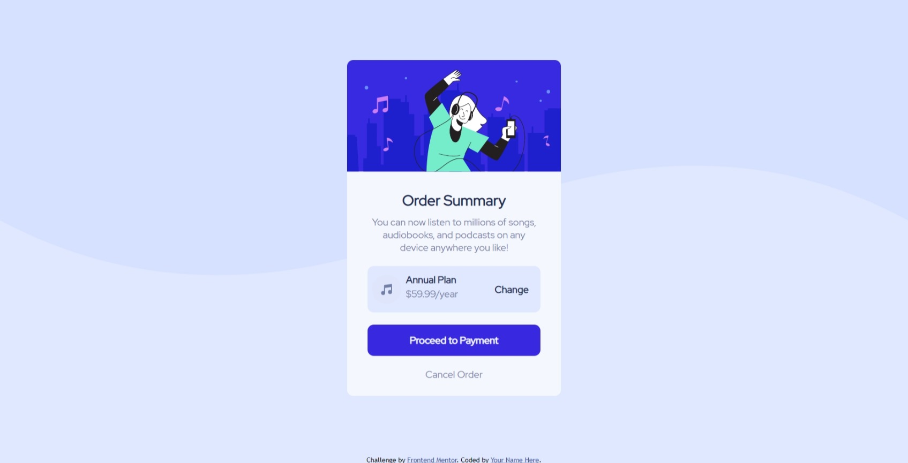

# Frontend Mentor - Order summary card solution

This is a solution to the [Order summary card challenge on Frontend Mentor](https://www.frontendmentor.io/challenges/order-summary-component-QlPmajDUj). Frontend Mentor challenges help you improve your coding skills by building realistic projects.

## Table of contents

- [Overview](#overview)
  - [The challenge](#the-challenge)
  - [Screenshot](#screenshot)
  - [Links](#links)
- [My process](#my-process)
  - [Built with](#built-with)
  - [What I learned](#what-i-learned)
  - [Continued development](#continued-development)
  - [Useful resources](#useful-resources)
- [Author](#author)
- [Acknowledgments](#acknowledgments)

**Note: Delete this note and update the table of contents based on what sections you keep.**

## Overview

### The challenge

Users should be able to:

- See hover states for interactive elements

### Screenshot



### Links

- Solution URL: [GitHub Repository](https://github.com/Codedzephyr/order-summary-component-main)
- Live Site URL: [Live Site URL](https://tender-kilby-4c1bb5.netlify.app/)

### Built with

- Semantic HTML5 markup
- CSS custom properties
- Flexbox
- CSS Grid
- Mobile-first workflow

### What I learned

```html
  <div class="content">
  <div class="content1">
  <p class="title1">Annual Plan</p>
 <p class="description1">$59.99/year</p>
    </div>
     </div>
 </div>
```

```scss
.button-container {
  width: 90%;
  margin: 0 auto;
  .button {
    border: none;
    background-color: $brightblue;
    color: $verypaleblue;
    font-size: $fontsize;
    font-family: $RedHatDisplay;
    font-weight: $fontweight700;
    cursor: pointer;
    text-align: center;
    padding: 15px 20px;
    width: 100%;
    margin: 20px auto;
    border-radius: 10px;
  }

  .button:hover {
    background-color: $desaturatedblue;
  }

  .description2 {
    text-align: center;
    font-family: $RedHatDisplay;
    font-size: $fontsize;
    color: $desaturatedblue;
    cursor: pointer;
  }
}
```

## Author

- Website - [Salihu Andulhamid](https://infallible-pike-a0b433.netlify.app/)
- Frontend Mentor - [@Codedzephyr](https://www.frontendmentor.io/profile/Codedzephyr)
- Twitter - [@dimah](https://www.twitter.com/_Dimah__)
